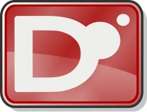

<head>
    <link rel="stylesheet" href="default.css">
</head>

<body>
<h1>
    Hello! I'm Exyulantay!
</h1>
  

    

        

        I want to make software that people enjoy and find useful. 
        I'm in to game development, desktop software, and systems development. 
        And I'm just starting to get into networking and cyber security.
        

    

    <h3> You can see cool stuff if you click this button --> <a href="https://www.nan0mk.net/" class="btnBlue">My Website</a> </h3>

  
</body>

## My tech stack

